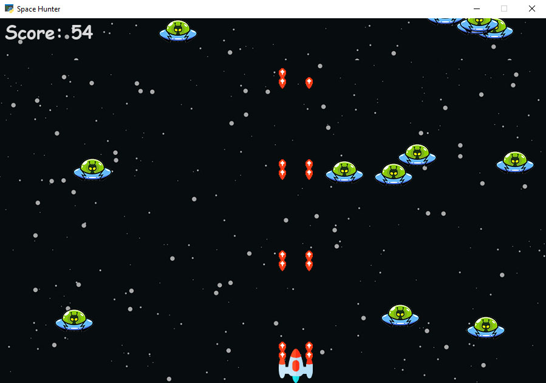

# Space Hunter Game

## Introduction
Run the game and enjoy!


## Windows Instructions
1. Upgrade `pip` to the latest version and install `virtualenv`:
```
py -m pip install --upgrade pip
py -m pip install --user virtualenv
```
2. Go to the project's directory and make a new virtual environment:
```
py -m venv env
```
3. Activate the virtual environment:
```
.\env\Scripts\activate
```
4. Install the necessary packages listed in the `requirements.txt` file:
```
py -m pip install -r requirements.txt
```
5. Run the app:
```
py main.py
```

## Linux Instructions
1. Upgrade `pip` to the latest version and install `virtualenv`:
```
python3 -m pip install --user --upgrade pip
python3 -m pip install --user virtualenv
```
2. Go to the project's directory and make a new virtual environment:
```
python3 -m venv env
```
3. Activate the virtual environment:
```
source env/bin/activate
```
4. Install the necessary packages listed in the `requirements.txt` file:
```
pip install -r requirements.txt
```
5. Run the app:
```
python3 main.py
```

## Contributers
<table>
  <tr>
    <td align="center">
      <a href="#">
        <br>
        <sub>
          <b>Mohammad Arabzadeh</b>
        </sub>
      </a>
    </td>
    <td align="center">
      <a href="https://github.com/HRSK2000">
        <br>
        <sub>
          <b>Hamireza Safari</b>
        </sub>
      </a>
    </td>
</table>
